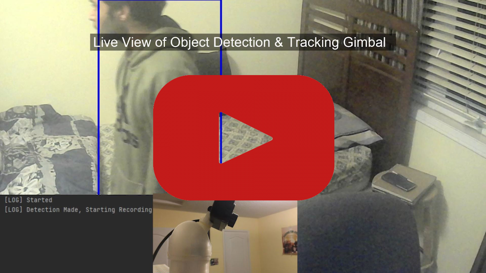

# Video-Surveillance-system

The following is a video surveillance system that uses Artificial Intelligence to track and record all instances of human activity, storing these occurrences to a database for further review.

##The complete system can be split into 3 parts:

- 3-Axis Camera Gimbal 
- Custom Computer vision AI models 
- SQL Database interface

### Axis Camera Gimbal

The 3 Axis Gimbal, which was designed to be compatible with common hobby servo motors, provides the system the ability to look around a given location, increasing the theoretical field of view by over 180 degrees in both the z and x rotation axis. This system is controlled via an arduino, which communicates to the software on the host via serial communication using a custom protocol to transmit instructions.

### Computer vision AI models

The AI within the overall system is the heard of what makes the system intelligent. This model is trained using a custom dataset designed to maximize performance on unseen data, as well as uses a system that supports transfer learning (Can be found under the Object Detection repository). This model is specifically optimized to have high performance on mid to low tier hardware, removing the requirement for advanced hardware often present for systems like this.

### SQL Database interface

All the instances of detected humans that have been tracked until out of view are encoded, and then saved to an SQL database from where they can be viewed later with the included utility script. The database records all critical information such as the time and date of the occurrence, which will be displayed when exporting the data.
